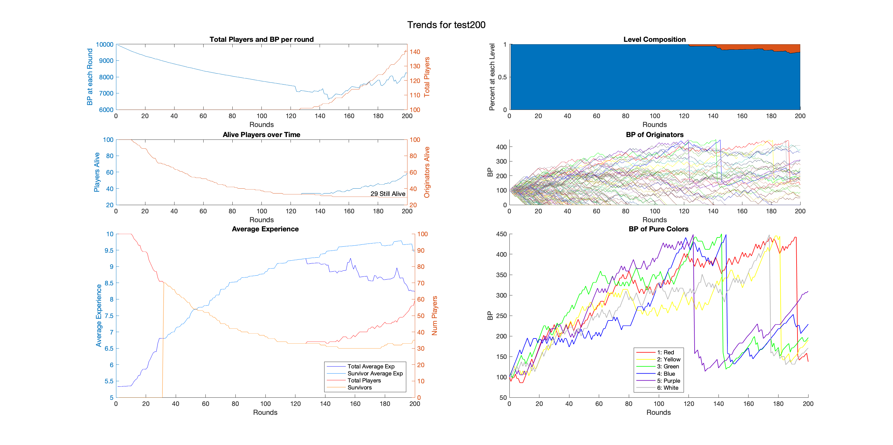

# Brain Burst Simulation: test200 
## Parameters 
### Global: 
Seed: 2039, Number of Rounds: 200 
### makePlayer (Player Creation Function): 
Experience Version: cont (continuous or discrete)
Possible Experience Range: 1 to 10(discrete integer values only) 
Maximum possible Experience: 10 (continuous distrobution) 
### duel (Individual Duels): 
Modifier for experience gain: 0.050000 

Image Test!

