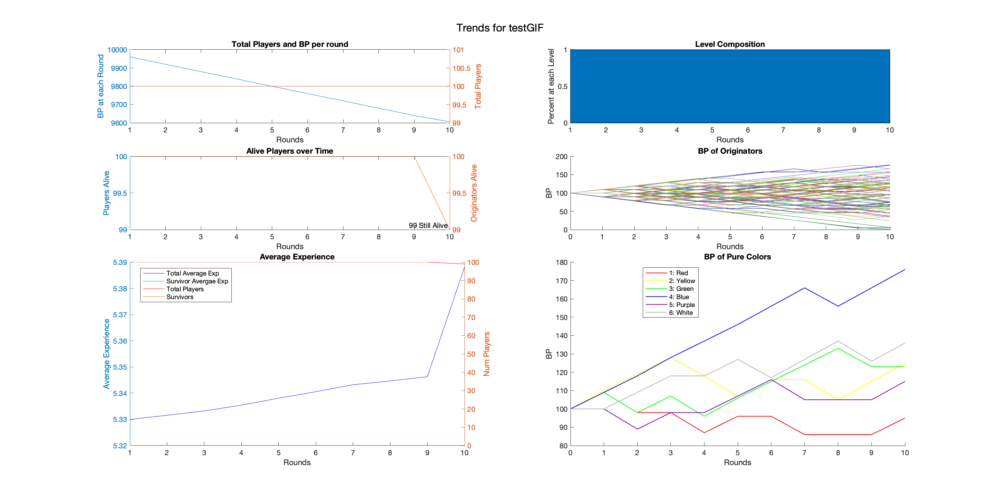

# Brain Burst Simulation: test1 

## Graphical Trends in the Simulation:

## Parameters 
### Global: 

Seed: 2039, Number of Rounds: 10 

--- 

### makePlayer (Player Creation Function): 

Experience Version: cont (continuous or discrete)

Possible Experience Range: 1 to 10(discrete integer values only) 

Maximum possible Experience: 10 (continuous distrobution) 

Beta Distrobution Factors for Saturation: A = 1.75B = 1.50 

Beta Distrobution Factors for Luminance: A = 7.00B = 6.00 

--- 

### duel (Individual Duels): 

Modifier for experience gain: 5.00e-02 

Tolerance for Draws: 5.00e-05 

Point Transfer Function if Winner is higher levelled: @(lvlDiff)round(10/(1+lvlDiff)) 

Point Transfer Function if Winner is lower levelled: @(lvlDiff)(10*(1+lvlDiff)) 

Points to tranfer if both player are of equal level: 10 

Points to transfer in a draw: 0

Level Contribution Function to Win Chance: @(lvl)lvl.^2 

--- 

### killEm (Eliminate Players):

None here yet :(

--- 

### lvlUp (Level Up Players) 

Points needed for each Level:

|Level|1 -> 2|2 -> 3|3 -> 4|4 -> 5|5 -> 6|6 -> 7|7 -> 8|8 -> 9|9 -> 10|
|---|---|---|---|---|---|---|---|---|---|
|Points|300|400|600|900|1500|3000|6000|10000|Undefined|

Safety Margin Multiplier: 1.50

--- 

### makeBabes (Create Gen2+ Players)

Chance of Kid Function: @(x)randi(floor(x/30)+1,1) 

--- 

### Pure Colors (Easy to follow Players) 

Color Values (HSL): 

|King |Color|Saturation|Luminance|
|---|---|---|---|
| Red | 0 | 100 | 50 |
| Yellow | 60 | 100 | 50 |
| Green | 120 | 100 | 50 |
| Blue | 240 | 100 | 50 |
| Purple | 275 | 100 | 37 |
| White | 180 | 0 | 100 |

Experience of each Pure Color: 11.00

--- 

